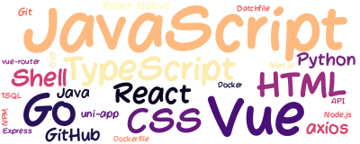

<!-- background image -->


<!-- main introduction -->
## 🛸 Hello World !

- Here's ColaCheese, a software developer 💻 with a cute ragdoll 🐱. 
- Full stack developer, using Vue, Node.js to do some exploration of Web visualization ✨.
- PS5, Steam and mobile game player (cannot live without coding and games lol) 🎮.
- The future plan is trying to be a freelancer 😵.

<a href="https://github.com/ColaCheese">

</a>
&nbsp&nbsp&nbsp&nbsp&nbsp&nbsp&nbsp&nbsp&nbsp&nbsp
<a href="https://github.com/ColaCheese">

</a>


<!-- wakatime data -->
<details>
<summary align="center">More Data 👆</summary>

<!--START_SECTION:waka-->


**🐱 My GitHub Data** 

> 📦 32.6 kB Used in GitHub's Storage 
 > 
> 🏆 2 Contributions in the Year 2026
 > 
> 🚫 Not Opted to Hire
 > 
> 📜 6 Public Repositories 
 > 
> 🔑 2 Private Repositories 
 > 
📊 **This Week I Spent My Time On** 

```text
🕑︎ Time Zone: Asia/Shanghai

💬 Programming Languages: 
TypeScript               9 hrs 36 mins       ███████████████████████░░   91.54 % 
Vue.js                   36 mins             █░░░░░░░░░░░░░░░░░░░░░░░░   05.82 % 
JSON                     11 mins             ░░░░░░░░░░░░░░░░░░░░░░░░░   01.78 % 
JavaScript               3 mins              ░░░░░░░░░░░░░░░░░░░░░░░░░   00.53 % 
Bash                     2 mins              ░░░░░░░░░░░░░░░░░░░░░░░░░   00.33 % 

🔥 Editors: 
VS Code                  10 hrs 30 mins      █████████████████████████   100.00 % 

🐱‍💻 Projects: 
whisky-app               9 hrs 40 mins       ███████████████████████░░   92.10 % 
AI-Mock                  41 mins             ██░░░░░░░░░░░░░░░░░░░░░░░   06.62 % 
react-conf-app           8 mins              ░░░░░░░░░░░░░░░░░░░░░░░░░   01.28 % 

💻 Operating System: 
Mac                      10 hrs 30 mins      █████████████████████████   100.00 % 
```


<!--END_SECTION:waka-->

</details>

<!-- recent work -->
## 🌈 My Recent Work  

<table>
<tr>
<td valign="top" width="500 px">

#### 🚴 `Recent Events`

<!-- event starts -->
* 🚀 *Push* <a href=https://github.com/ColaCheese/ColaCheese target='_blank'>ColaCheese/ColaCheese</a> - 2026-03-16
* 🚀 *Push* <a href=https://github.com/ColaCheese/AI-Mock target='_blank'>ColaCheese/AI-Mock</a> - 2026-03-05
* 🍴 *Fork* <a href=https://github.com/Teernage/AI-Mock target='_blank'>Teernage/AI-Mock</a> - 2026-03-05
* 🚀 *Push* <a href=https://github.com/ColaCheese/ColaCheese target='_blank'>ColaCheese/ColaCheese</a> - 2026-03-02
* ⭐️ *Watch* <a href=https://github.com/Teernage/AI-Mock target='_blank'>Teernage/AI-Mock</a> - 2026-02-25
<!-- event ends -->

</td>

<td valign="top" width="500 px">

#### 🏂 `Current Blogs`

<!-- blog starts -->
* <a href=https://juejin.cn/post/7267092670823252029 title='当 VuePress 遇上 Vuetify' target='_blank'>当 VuePress 遇上 Vuetify</a> - 2年前
* <a href=https://juejin.cn/post/7267091509971189818 title='前端学习笔记 1：防抖和节流' target='_blank'>前端学习笔记 1：防抖和节流</a> - 2年前
* <a href=https://juejin.cn/post/7267091417029427261 title='Java学习笔记 6：WEB代理服务器' target='_blank'>Java学习笔记 6：WEB代理服务器</a> - 2年前
* <a href=https://juejin.cn/post/7267091417029394493 title='Java学习笔记 5：WEB 服务器和客户端' target='_blank'>Java学习笔记 5：WEB 服务器和客户端</a> - 2年前
* <a href=https://juejin.cn/post/7267088345402097719 title='Java学习笔记 4：基于 TCP & UDP 的网络文件服务' target='_blank'>Java学习笔记 4：基于 TCP & UDP 的网络文件服务</a> - 2年前
<!-- blog ends -->

</td>
</tr>

<tr>
<td valign="top" width="500 px">

#### 🍻 `Recent Stars`

<!-- star starts -->
* <a href=https://juejin.cn/post/7586505172815675443 title='请求洪峰来了，怎么使用消息队列削峰? 我们来深入的聊一下' target='_blank'>请求洪峰来了，怎么使用消息队列削峰? 我们来深入的聊一下</a>
* <a href=https://juejin.cn/post/7578793960627486746 title='不仅免费，还开源？这个 AI Mock 神器我必须曝光它' target='_blank'>不仅免费，还开源？这个 AI Mock 神器我必须曝光它</a>
* <a href=https://juejin.cn/post/7433687162870530084 title='最强平替Postman的工具，拒绝浏览器套壳' target='_blank'>最强平替Postman的工具，拒绝浏览器套壳</a>
* <a href=https://juejin.cn/post/7374702793562374194 title='React Native 0.74 Android 环境搭建指南' target='_blank'>React Native 0.74 Android 环境搭建指南</a>
* <a href=https://juejin.cn/post/7369861479384875049 title='React Native 开发心得分享' target='_blank'>React Native 开发心得分享</a>
<!-- star ends -->

</td>

<td valign="top" width="500 px">

#### 🎯 `Skill Cloud`

<!-- skill cloud starts -->

<!-- skill cloud ends -->

</td>
</tr>
</table>

<br />

<!-- footer -->
<p align="center">
&nbsp&nbsp
&nbsp&nbsp

</p>

<p align="center">
<i>
<!-- time starts -->
Automatically updated on 2026-03-23 08:22:52
<!-- time ends -->
</i>
</p>
