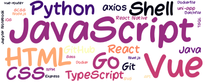

<!-- background image -->


<!-- main introduction -->
## 🛸 Hello World !

- Here's ColaCheese, a software developer 💻 with a cute ragdoll 🐱. 
- Full stack developer, using Vue, Node.js to do some exploration of Web visualization ✨.
- PS5, Steam and mobile game player (cannot live without coding and games lol) 🎮.
- The future plan is trying to be a freelancer 😵.

<a href="https://github.com/ColaCheese">

</a>
&nbsp&nbsp&nbsp&nbsp&nbsp&nbsp&nbsp&nbsp&nbsp&nbsp
<a href="https://github.com/ColaCheese">

</a>


<!-- wakatime data -->
<details>
<summary align="center">More Data 👆</summary>

<!--START_SECTION:waka-->


**🐱 My GitHub Data** 

> 📦 152.7 kB Used in GitHub's Storage 
 > 
> 🏆 135 Contributions in the Year 2024
 > 
> 🚫 Not Opted to Hire
 > 
> 📜 8 Public Repositories 
 > 
> 🔑 4 Private Repositories 
 > 
📊 **This Week I Spent My Time On** 

```text
🕑︎ Time Zone: Asia/Shanghai

💬 Programming Languages: 
YAML                     10 hrs 9 mins       ██████████████░░░░░░░░░░░   55.14 % 
Other                    3 hrs 46 mins       █████░░░░░░░░░░░░░░░░░░░░   20.53 % 
Go                       1 hr 38 mins        ██░░░░░░░░░░░░░░░░░░░░░░░   08.94 % 
JavaScript               1 hr                █░░░░░░░░░░░░░░░░░░░░░░░░   05.45 % 
Nginx configuration file 57 mins             █░░░░░░░░░░░░░░░░░░░░░░░░   05.24 % 

🔥 Editors: 
VS Code                  18 hrs 25 mins      █████████████████████████   100.00 % 

🐱‍💻 Projects: 
demeter                  16 hrs 3 mins       ██████████████████████░░░   87.17 % 
web                      1 hr 6 mins         ██░░░░░░░░░░░░░░░░░░░░░░░   06.03 % 
gin-vue-admin-main       53 mins             █░░░░░░░░░░░░░░░░░░░░░░░░   04.86 % 
Unknown Project          18 mins             ░░░░░░░░░░░░░░░░░░░░░░░░░   01.64 % 
galacean-demo            3 mins              ░░░░░░░░░░░░░░░░░░░░░░░░░   00.30 % 

💻 Operating System: 
Mac                      18 hrs 25 mins      █████████████████████████   100.00 % 
```


<!--END_SECTION:waka-->

</details>

<!-- recent work -->
## 🌈 My Recent Work  

<table>
<tr>
<td valign="top" width="500 px">

#### 🚴 `Recent Events`

<!-- event starts -->

<!-- event ends -->

</td>

<td valign="top" width="500 px">

#### 🏂 `Current Blogs`

<!-- blog starts -->

<!-- blog ends -->

</td>
</tr>

<tr>
<td valign="top" width="500 px">

#### 🍻 `Recent Stars`

<!-- star starts -->

<!-- star ends -->

</td>

<td valign="top" width="500 px">

#### 🎯 `Skill Cloud`

<!-- skill cloud starts -->

<!-- skill cloud ends -->

</td>
</tr>
</table>

<br />

<!-- footer -->
<p align="center">
&nbsp&nbsp
&nbsp&nbsp

</p>

<p align="center">
<i>
<!-- time starts -->
Automatically updated on 2025-07-28 09:24:17
<!-- time ends -->
</i>
</p>
